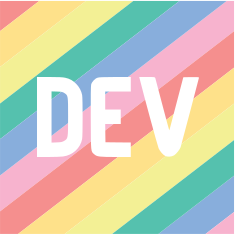

<h1 align="left">Olá 👋, sou Raul R. Soares</h1>
<h3 align="left">Tecnico em Redes de computadores em ascensão p/ DevOps</h3>

<!--

    <ul>
        <li>Atualmete trabalhando com o peojeto de um robô sumo com controle remoto para as aulas de robótica no sesi <a href="https://github.com/raulrsoares/robot" target="_blank"> repositório </a> 
    </ul>

 
-->

<h3 align="left">Conecte-se comigo:</h3>

    <!--
     -->
    
    
    
     
     
    

<h3 align="left">:unlock:Idiomas e ferramentas:unlock:</h3>

    
    
    
    
    
    <!--
      -->
    <!--
     -->
    <!-- 
     -->
    <!--
     -->
    <!--
     -->

<!--
<h3 align="left">:construction:  Projetos em construção  :construction:</h3>

-->

<h3 align="left">:open_file_folder:Ultimos Projetos:open_file_folder:</h3>

    
    
    
    

 

     
    

   

<h3> Total de Visitas 🔍 </h3>
<!-- 
  

-->

  

---

Copyright © 2022 Raul R. Soares 
